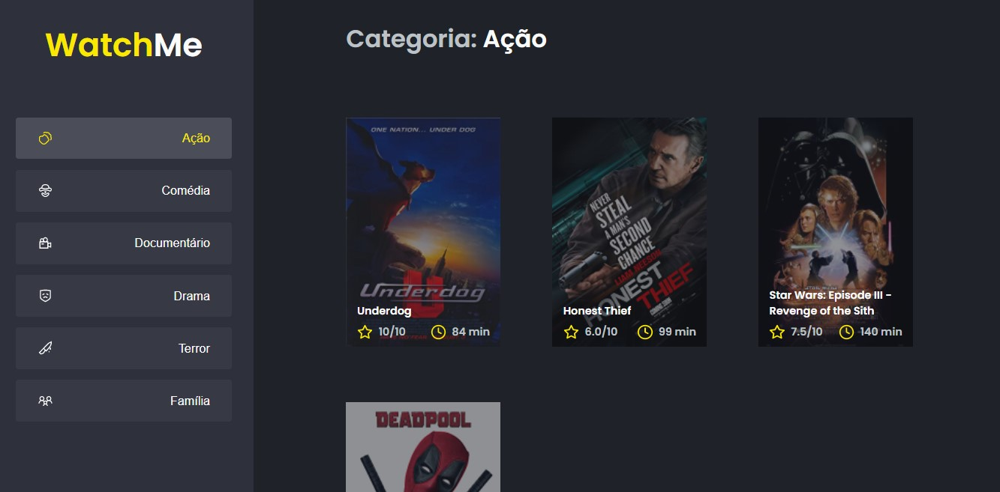

# Sobre o desafio

O principal objetivo deste desafio é refatorar uma página, aplicando os conceitos de componentização do React JS.

## Sobre a aplicação

- A aplicação possui apenas uma funcionalidade principal que é a listagem de filmes;
- Na sidebar é possível selecionar qual categoria de filmes deve ser listada;
- O header da aplicação possui apenas o nome da categoria selecionada que deve mudar dinamicamente.
- A lista de filmes é fornecida por uma API Fake fornecida com JSON Sever.

## Sobre a resolução

- Toda estrutura da aplicação estava concentrada no componente principal App.tsx.
- A componentização foi dividida basicamente em duas: A SideBar, responsavel pela listagem e seleção dos generos e a Content, que é responsavel por listar os filmes de acordo com o genero selecionado na SideBar.
- Utilizei o conceito de [Elevar o State](https://pt-br.reactjs.org/docs/lifting-state-up.html) para fazer com que a informação de genero selecionado fosse disponibilizada tanto para a SideBar quanto para a Content.
